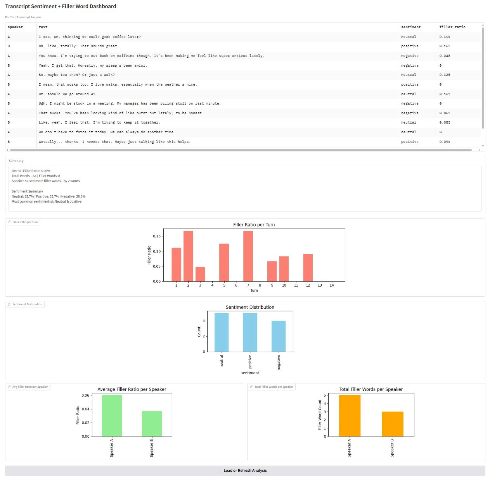

# Transcript Sentiment + Filler Word Dashboard

- Repository URL: https://github.com/lukisoo/transcript-analyser
- Branch: `main`

This project is a self-contained Python application that loads a conversational transcript and analyses it for:

- Per-turn **sentiment** (`positive`, `neutral`, or `negative`)
- **Filler word ratios** (e.g., "um", "like", "you know")
- Per-speaker filler usage
- Summary metrics and charts via an interactive **Gradio dashboard**

---

## 📂 Project Structure

```
├── app.py                # Gradio-based dashboard
├── analysis.py           # Transcript parsing + metrics
├── transcript.txt        # Sample dialogue input
├── requirements.txt      # Project dependencies
├── README.md             # This file
└── output.png            # Screenshot of the dashboard
```

---

## Set up instructions

### 1. Clone this GitHub Repository

```bash
git clone https://github.com/lukisoo/transcript-analyser.git
cd transcript-analyser
```

### 2. Create a virtual environment (optional, but recommended)


On Windows:
```bash
python -m venv venv
 venv\Scripts\activate
```

On Mac (I use Windows - unfortunately I do not have a Mac readily available to test on):
```bash
python -m venv venv
source venv/bin/activate
```

### 3. Install dependencies

```bash
pip install -r requirements.txt
```

### 4. Run the application

```bash
python app.py
```

This will launch the Gradio interface in your browser, which can be accessed at `http://127.0.0.1:7860`.

Below is an example of the visual dashboard output, for the given `transcript.txt` file.



Click on the 'Load or Refresh Analysis' button to generate the summary and charts.

---

## Transcript Format

The `transcript.txt` should have the following format:

- Contain **12–16 lines** of dialogue
- Alternate between **Speaker A** and **Speaker B**
- Include at least **3 filler word occurrences**, such as:

  > um, uh, like, so, i mean, you know

Example:

```
Speaker A: I was, um, thinking we could grab coffee later?
Speaker B: Oh, like, totally! That sounds great.
...
```

While the code does handle some edge cases (e.g. if a speaker has no corresponding dialogue), it does assume that the transcript exists and is formatted in the correct 'Speaker A: ...' pattern.

---

## 📊 Metrics Computed

| Metric                             | Description                                                                          |
| ---------------------------------- | ------------------------------------------------------------------------------------ |
| **Sentiment per turn**             | Sentiment label (`positive`, `neutral`, or `negative`) using a Hugging Face pipeline |
| **Filler ratio per turn**          | Ratio of filler words to total words for each line of dialogue                       |
| **Overall filler ratio**           | Total filler words ÷ total words across the entire transcript                        |
| **Per-speaker filler ratio**       | Average filler use (words ÷ words spoken) for each speaker                           |
| **Total filler words per speaker** | Count of filler words per speaker                                                    |
| **Sentiment distribution**         | Frequency of each sentiment class in the conversation                                |

I chose to display the following as required metrics:

- The sentiment and the filler ratio per line of dialogue
- The overall sentiment (what is the most common sentiment of the transcript)
- The overall filler ratio (what is the percentage of filler words across all words spoken)

I additionally chose to display:

- Visualisations for the above mentioned metrics. This makes visual comparison of metrics much easier to the user.
- The filler words ratio per speaker, and which speaker spoke more filler words. If this transcript analysis were to analyse speaking style for individuals, a user may be interested in how many filler words they were speaking themselves, as opposed to across the whole conversation.

---

## 💡 In one extra hour I would...

### Functionality

Add a **sentiment timeline graph** to visualise how the emotional tone of the conversation shifts over time. This could help highlight key moments of positivity, negativity, or neutrality.

### UI

- Use markdown (https://www.gradio.app/docs/gradio/markdown) to improve the display of the summary and other key results to the user.
- Make the filler ratios per line more readable to the user (i.e. convert to display in percentages)
